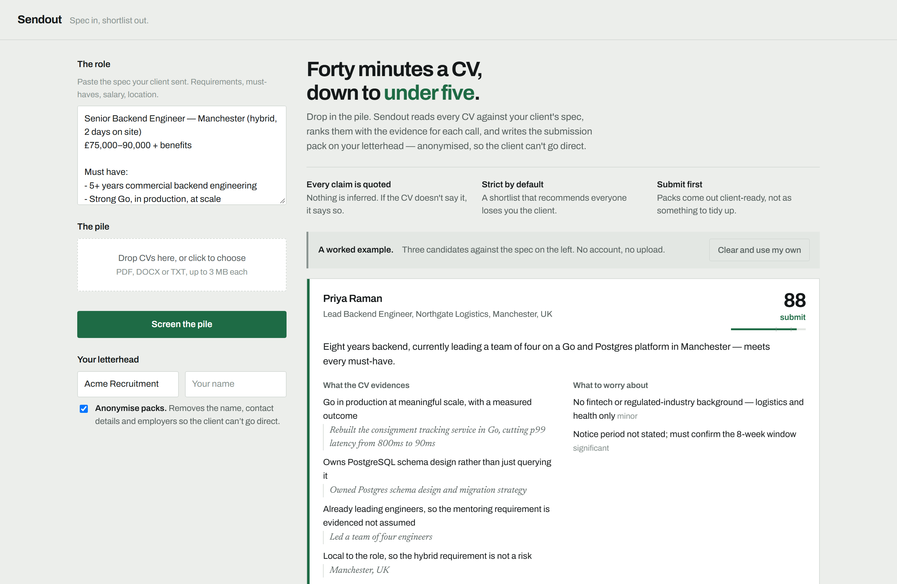

# Sendout — AI CV Screening and Candidate Shortlisting for Recruitment Agencies

**Spec in, shortlist out.** Sendout is an open-source AI CV screening tool (resume screening, if
you're in the US). Paste the job spec your client sent, drop in the pile of CVs, and get back a
ranked candidate shortlist where every judgement is backed by a quote from the CV. One click then
turns any candidate into a client-ready submission pack on your own letterhead, anonymised so the
client can't go direct.

[](LICENSE)
[](tsconfig.json)
[](https://vercel.com/new/clone?repository-url=https%3A%2F%2Fgithub.com%2Fkapoordeepanshu%2Fsendout&env=ANTHROPIC_API_KEY,APP_PASSWORD)

**[Live demo](https://sendout-dk.vercel.app)** · [Features](#features) · [Quick start](#quick-start) · [Deploy your own](#deploy-your-own) · [FAQ](#faq)



Built for small recruitment agencies and in-house recruiters. It removes the 20–40 minutes per
candidate that goes into reading, writing up and formatting a CV before it can be submitted, and
the placements lost to whichever agency submitted first.

---

## Features

- **AI CV screening against the job spec.** A 0–100 match score and a submit / maybe / reject
  verdict for every candidate, ranked into a shortlist.
- **Evidence, not guesses.** Every strength quotes the CV verbatim. Anything the CV doesn't say
  comes back as "Not stated on CV".
- **Requirement ledger.** Each must-have and nice-to-have in the spec marked met, partial or not
  met, with a note.
- **Gaps and risks**, graded blocker, significant or minor — like a notice period that misses the
  client's start date.
- **Screening questions** aimed at each candidate's specific unknowns.
- **Anonymised submission packs (blind CVs).** Name, contact details and employer names removed,
  so a client can read the profile without approaching the candidate directly.
- **CV parsing** for PDF, DOCX and TXT.
- **Choose your AI model.** Anthropic, OpenAI or Google Gemini, switched with one environment
  variable.
- **Batch screening.** CVs are screened four at a time and results appear as they land.
- **No database.** Deploys to Vercel's free tier in a few minutes.

---

## Quick start

```bash
git clone https://github.com/kapoordeepanshu/sendout.git
cd sendout
npm install
cp .env.example .env        # add your API key
npm run dev
```

Open <http://localhost:3000>.

| Variable | Required | What it does |
| --- | --- | --- |
| `MODEL_PROVIDER` | No | `anthropic` (default), `openai` or `gemini`. |
| `MODEL_NAME` | No | Override the default model for that provider. |
| `ANTHROPIC_API_KEY` / `OPENAI_API_KEY` / `GEMINI_API_KEY` | Whichever provider you chose | Powers screening and pack writing. Server-side only — it never reaches the browser, and it never goes in git. |
| `APP_PASSWORD` | In production | Shared password for the deployed app. **A deployment without it refuses every request**, so a public URL can never sit open. Optional locally. |
| `COMPANIES_HOUSE_API_KEY` | Optional | Only for building a UK agency prospect list — see [docs/PROSPECTING.md](docs/PROSPECTING.md). |

---

## How it works

### Screening

One model call per CV, returning a strict schema rather than prose:

- **Match score, 0–100**, and a verdict: submit, maybe, or reject
- **Evidenced strengths** — every claim carries a verbatim quote from the CV
- **Gaps and risks**, graded blocker / significant / minor
- **A requirement ledger** — each requirement in the spec marked met, partial or not met, with a note
- **Screening questions** aimed at that candidate's specific unknowns

Two rules are built into the prompt and matter more than any feature. It never infers anything
the CV does not say — absent information comes back as "Not stated on CV", not a guess. And it
is told that a shortlist recommending everyone is worthless, because an agency that submits
everyone loses the client.

### Submission packs

An assessment plus the raw CV becomes a client-facing profile: summary, requirements table,
relevant experience, the honest gaps, and availability.

**Anonymisation is on by default.** It removes the name, contact details and employer names,
replacing employers with descriptions like "a FTSE 250 retail bank", so a client can read the
profile without being able to approach the candidate directly. That protects your fee.

The job spec is cached across a batch, so screening thirty CVs pays for the spec once.

### Swapping the model

Every model call goes through one interface in `src/providers/`, so switching is
two environment variables:

```bash
MODEL_PROVIDER=openai   OPENAI_API_KEY=...
MODEL_PROVIDER=gemini   GEMINI_API_KEY=...
```

The prompts and the schema in `src/screening.ts` are provider-agnostic and are what
actually determine output quality. Three things differ underneath:

- **Structured output.** Anthropic uses a strict tool, OpenAI uses
  `response_format: json_schema`, Gemini uses `responseSchema`. Gemini's dialect is an
  OpenAPI subset rather than JSON Schema — it rejects `additionalProperties`, wants
  uppercase type names, and marks optional fields `nullable: true` instead of a
  `["string", "null"]` union — so `toGeminiSchema` translates ours on the way out.
- **Caching, which is the real cost difference.** Anthropic caches the job spec
  explicitly, so a 30-CV batch pays for it once. OpenAI caches automatically above a
  token threshold with no explicit placement. Gemini's explicit caching has a minimum
  size a job spec usually falls under, so the spec is re-charged on every CV.
- **The adapters.** Anthropic uses its SDK; OpenAI and Gemini go over REST, which adds
  no dependency and nothing to keep in step with SDK releases.

Anthropic is the default because the prompts were written and tuned against it. Before
switching, assemble twenty CVs you have already judged by hand and compare — "the output
looks fine" is not a measurement, and screening judgement is the whole point of the tool.

### Demo CVs

`samples/` holds three CVs written against the job spec the app opens with, in three formats so
a demo also exercises all three extractors:

| File | Should score | What it hides |
| --- | --- | --- |
| `marcus-ellery-cv.pdf` | High | Meets every requirement, but his 3-month notice misses the client's 8-week window |
| `sofia-marchetti-cv.docx` | Middling | Strong on the nice-to-haves; Go is one year old and the salary ask is above band |
| `dan-okafor-cv.txt` | Low | Reads confidently, has none of the must-haves, and there's an unexplained career break |

All three candidates are fictional. Regenerate them with `npm run samples`.

### Try it without a key

The interface opens with a worked example — a real spec, three assessed candidates, and a
finished submission pack — rendered from local sample data with no API call and no password.
Anyone you send the link to sees what the tool produces before they touch anything.

---

## Deploy your own

Click **Deploy with Vercel** above, or fork this repo and import it at
[vercel.com/new](https://vercel.com/new). Vercel redeploys on every push and gives a free preview
URL per branch. Add your provider's API key and `APP_PASSWORD` in project settings.

Or from the CLI:

```bash
npm i -g vercel
vercel                            # first deploy, links the project
vercel env add ANTHROPIC_API_KEY
vercel env add APP_PASSWORD
vercel --prod
```

`vercel dev` runs the real serverless routes locally.

### Two constraints shaped the architecture

- **One CV per request.** Serverless functions have a hard wall-clock limit, so the browser fans
  out four at a time rather than asking the server to loop over a batch. Results render as they
  land instead of after one long silence.
- **No server state.** Functions share no memory between invocations, so extracted CV text
  returns to the browser and comes back when building the pack. Request bodies cap at 4.5 MB,
  which is why the interface rejects files over 3 MB — base64 inflates a file by about a third.

### Keys and secrets

The API key belongs in exactly two places: `.env` on your machine, and Vercel's environment
variables. **Never commit it** — a key stays in git history even after you delete the line.

The password gate stops strangers. **Also set a hard monthly spend limit in your provider's
console** — that is what stops a bug, or a password that got forwarded, from running up a bill
you did not agree to. Everyone using a deployment spends the deployment's key; there is no
per-user metering yet.

---

## Project layout

```
api/                 Serverless routes — thin wrappers over the handlers
src/screening.ts     Prompts and schema. This is where output quality lives.
src/providers/       Anthropic, OpenAI and Gemini adapters behind one interface
src/handlers.ts      Request handling, shared by serverless and local dev
src/auth.ts          Shared-password gate
src/extract.ts       PDF / DOCX / TXT text extraction
src/server.ts        Local dev server only — never deployed
public/index.html    The entire interface. One file, no build step.
public/sample.js     Worked example shown on first load
samples/             Three demo CVs matching the built-in job spec
scripts/             Companies House prospect-list builder, demo CV generator
docs/                Project status, outreach and prospecting notes
```

### Design notes

The interface reads as a marked assessment sheet rather than a dashboard, because that is what a
recruiter is producing. Two typefaces with distinct jobs: the tool speaks in Archivo, and the
**candidate's CV speaks in Newsreader** — every quotation lifted from a CV is set in serif
italic, so source material stays visually separate from the system's own claims. The submission
pack is a document, so it is set wholly in the serif.

Colour is spent only on the verdict; everything else is near-monochrome. Nothing is
distinguished by colour alone — verdicts pair a word with a position on the meter, and
requirement marks pair a glyph with a word.

---

## Cost

Screening runs on `claude-opus-5` at high effort by default, because match quality is the point.
Roughly $0.05–0.07 per CV. `claude-sonnet-5` is about a third of that, for a one-line change:

```bash
MODEL_NAME=claude-sonnet-5
```

If cost is the motive, that step down saves more than switching provider does. Measure it
against CVs you have already judged by hand before making it the default.

---

## Known limits

This is a working demo, not a finished product.

- **No accounts, no usage metering, no persistence.** A shortlist lives in the browser tab and
  disappears on refresh.
- **Scanned CVs with no text layer are skipped**, and reported in the interface rather than
  silently dropped. OCR is the fix.
- PDF text extraction uses `unpdf`, not `pdf-parse` — the latter bundles pdf.js from 2018 and
  failed on a valid PDF with "bad XRef entry". PDF is the format most CVs arrive in, so a stale
  parser silently loses candidates. Don't swap it back.
- The shared password suits demo links. It is not a user system.
- Transient provider failures (429, 503) are retried four times with exponential backoff and
  jitter, because a model under load would otherwise silently drop CVs from a batch and leave
  the recruiter with a shorter shortlist and no reason to distrust it. Real errors, like a
  rejected schema, still fail immediately.

---

## FAQ

**Is Sendout free?**
Yes. The code is MIT-licensed. You pay only for the AI model calls on your own API key — about
$0.05–0.07 per CV on the default model, and less on smaller ones.

**Which AI models does it support?**
Anthropic, OpenAI and Google Gemini. Set `MODEL_PROVIDER` and the matching API key; `MODEL_NAME`
overrides the default model.

**Does it store CVs?**
No. There is no database. CV text goes from the browser to your model provider and back, and is
gone when the tab closes. Your provider's own data-retention policy still applies.

**Can it anonymise CVs before they go to a client?**
Yes, and it does by default. Submission packs remove the candidate's name, contact details and
employer names.

**Does it read scanned CVs?**
Not yet. PDFs with no text layer are skipped and listed in the interface.

**Is it an applicant tracking system (ATS)?**
No. It covers one step: from a pile of CVs to a shortlist and a client submission. It sits
alongside whatever ATS you already use.

---

## Contributing

Issues and pull requests are welcome. Output quality lives in `src/screening.ts` — if you change
a prompt, run the three CVs in `samples/` and check the scores still land where the
[Demo CVs](#demo-cvs) table says. Run `npm run typecheck` before opening a pull request.

## Background

Sendout started as a product experiment for small UK recruitment agencies. The notes from that
are kept in `docs/`:

- [docs/STATUS.md](docs/STATUS.md) — where the project got to
- [docs/OUTREACH.md](docs/OUTREACH.md) — finding agencies and the emails sent to them
- [docs/PROSPECTING.md](docs/PROSPECTING.md) — building a prospect list from Companies House

## License

MIT — see [LICENSE](LICENSE).
